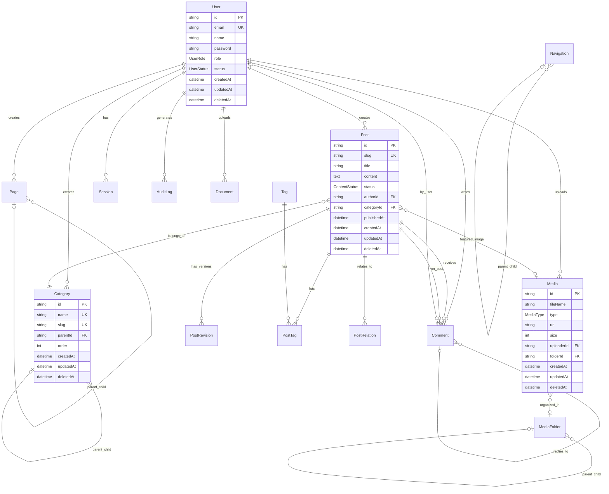

# Database Schema Documentation - ASOF CMS

## 📊 Overview

Este documento descreve o schema completo do banco de dados para o sistema de CMS do site ASOF. O schema foi projetado para PostgreSQL usando Prisma ORM, seguindo as melhores práticas de modelagem de dados, performance e segurança.

## 🎯 Objetivos do Schema

- **Escalabilidade**: Suportar crescimento de conteúdo e usuários
- **Performance**: Índices otimizados e queries eficientes
- **Segurança**: Soft deletes, audit trails, e controle de acesso
- **Flexibilidade**: Suporte a múltiplos tipos de conteúdo
- **Integridade**: Constraints e relacionamentos bem definidos

## 📈 Diagrama ER (Entity Relationship)



## 📚 Entidades Principais

### 1. User Management

#### **User**
Gerencia todos os usuários do sistema com diferentes níveis de acesso.

**Campos principais:**
- `id`: CUID único
- `email`: Email único para login
- `password`: Hash bcrypt da senha
- `role`: Papel do usuário (SUPER_ADMIN, ADMIN, EDITOR, AUTHOR, VIEWER)
- `status`: Status da conta (ACTIVE, INACTIVE, SUSPENDED, PENDING_VERIFICATION)

**Segurança:**
- Failed login tracking
- Account locking
- Password reset tokens
- Email verification
- Last login tracking

**Relacionamentos:**
- **1:N** com Posts (autor)
- **1:N** com Pages (autor)
- **1:N** com Media (uploader)
- **1:N** com Sessions (sessões ativas)
- **1:N** com AuditLogs (histórico de ações)

#### **Session**
Gerencia sessões de usuários autenticados.

**Campos principais:**
- `sessionToken`: Token único da sessão
- `expires`: Data de expiração
- `ipAddress`: IP do usuário
- `userAgent`: Informações do navegador

### 2. Content Management

#### **Post**
Armazena notícias e artigos do blog (migração do sistema MDX).

**Campos principais:**
- `slug`: URL amigável única
- `title`: Título do post
- `content`: Conteúdo em Markdown/HTML
- `status`: Status de publicação (DRAFT, IN_REVIEW, PUBLISHED, etc.)
- `excerpt`: Resumo para listagens
- `readingTime`: Tempo de leitura calculado

**SEO:**
- `metaTitle`: Título otimizado para SEO
- `metaDescription`: Descrição meta
- `metaKeywords`: Palavras-chave
- `ogImage`: Imagem Open Graph

**Features:**
- Publicação programada (`scheduledAt`)
- Sistema de destaque (`isFeatured`)
- Contador de visualizações (`viewCount`)
- Versionamento (`PostRevision`)
- Posts relacionados (`PostRelation`)

**Relacionamentos:**
- **N:1** com User (autor)
- **N:1** com Category (categoria)
- **N:1** com Media (imagem destacada)
- **N:N** com Tags (através de PostTag)
- **1:N** com Comments (comentários)
- **1:N** com PostRevisions (versões)

#### **PostRevision**
Histórico de versões dos posts para auditoria e restauração.

**Campos principais:**
- `version`: Número da versão
- `title`, `content`, `excerpt`: Snapshot do conteúdo
- `createdBy`: Usuário que criou a versão

#### **PostRelation**
Relaciona posts similares ou relacionados (many-to-many self-relation).

#### **Page**
Páginas estáticas ou dinâmicas do site (Sobre, Contato, etc.).

**Campos principais:**
- `type`: Tipo de página (STATIC, DYNAMIC, LANDING, CUSTOM)
- `template`: Identificador do template a usar
- `parentId`: Permite hierarquia de páginas
- `showInNav`: Se aparece no menu
- `isHomepage`: Marca a homepage

**Relacionamentos:**
- **N:1** com User (autor)
- **Self-reference** para hierarquia (parent/children)

#### **Category**
Categorias hierárquicas para organizar conteúdo.

**Campos principais:**
- `name`: Nome da categoria
- `slug`: URL amigável
- `color`: Cor hexadecimal para UI
- `icon`: Identificador do ícone
- `parentId`: Categoria pai (hierarquia)
- `order`: Ordem de exibição

**Relacionamentos:**
- **Self-reference** para hierarquia
- **1:N** com Posts

#### **Tag**
Tags para classificação flexível de conteúdo.

**Relacionamentos:**
- **N:N** com Posts (através de PostTag)

### 3. Media Management

#### **Media**
Biblioteca de mídia centralizada (imagens, vídeos, documentos).

**Campos principais:**
- `fileName`: Nome único do arquivo
- `type`: Tipo de mídia (IMAGE, VIDEO, DOCUMENT, AUDIO, OTHER)
- `size`: Tamanho em bytes
- `width`, `height`: Dimensões (para imagens/vídeos)
- `url`: URL de acesso
- `thumbnailUrl`: URL da miniatura
- `path`: Caminho no storage
- `bucket`: Bucket S3 ou storage

**Metadados:**
- `alt`: Texto alternativo (acessibilidade)
- `caption`: Legenda
- `title`: Título
- `description`: Descrição

**Relacionamentos:**
- **N:1** com User (uploader)
- **N:1** com MediaFolder (organização)
- **1:N** com Posts (como featured image)

#### **MediaFolder**
Organização hierárquica de mídia em pastas.

**Relacionamentos:**
- **Self-reference** para hierarquia
- **1:N** com Media

### 4. Comments & Engagement

#### **Comment**
Sistema de comentários com suporte a respostas aninhadas.

**Campos principais:**
- `content`: Conteúdo do comentário
- `status`: Status de moderação
- `authorName`, `authorEmail`: Info de autor não registrado
- `parentId`: Para respostas aninhadas

**Relacionamentos:**
- **N:1** com Post
- **N:1** com User (opcional)
- **Self-reference** para respostas (parent/replies)

### 5. Transparency & Documents

#### **Document**
Documentos para portal da transparência (relatórios financeiros, atas, etc.).

**Campos principais:**
- `title`: Título do documento
- `fileName`: Nome do arquivo
- `fileUrl`: URL de download
- `category`: Categoria (Financeiro, Jurídico, Atas)
- `year`, `month`: Organização temporal
- `isPublic`: Visibilidade pública
- `requiresAuth`: Requer autenticação
- `downloadCount`: Contador de downloads

**Relacionamentos:**
- **N:1** com User (uploader)

### 6. System & Configuration

#### **Setting**
Configurações do sistema armazenadas em banco.

**Campos principais:**
- `key`: Chave única da configuração
- `value`: Valor (JSON serializado)
- `type`: Tipo de dado (string, number, boolean, json)
- `category`: Categoria (general, seo, social, email)
- `isPublic`: Pode ser acessado no frontend

**Exemplos de configurações:**
```json
{
  "site.title": "ASOF - Associação dos Oficiais de Chancelaria",
  "site.description": "...",
  "social.facebook": "https://...",
  "email.smtp.host": "smtp.gmail.com",
  "seo.enableSitemap": true
}
```

#### **AuditLog**
Log de auditoria para rastreamento de todas as ações.

**Campos principais:**
- `action`: Tipo de ação (CREATE, UPDATE, DELETE, PUBLISH, etc.)
- `entityType`: Tipo de entidade afetada
- `entityId`: ID da entidade
- `changes`: Objeto JSON com before/after
- `ipAddress`, `userAgent`: Metadados da requisição

#### **Navigation**
Gerenciamento de menus e navegação do site.

**Campos principais:**
- `label`: Texto do menu
- `url`: URL de destino
- `location`: Localização (header, footer, sidebar)
- `parentId`: Para menus dropdown
- `order`: Ordem de exibição
- `openInNewTab`: Abrir em nova aba

**Relacionamentos:**
- **Self-reference** para hierarquia (dropdown menus)

### 7. Analytics & Tracking

#### **PageView**
Rastreamento de visualizações de páginas para analytics.

**Campos principais:**
- `path`: URL acessada
- `referer`: Origem do tráfego
- `country`, `city`: Geolocalização
- `device`, `browser`, `os`: Informações do dispositivo

### 8. Newsletter & Engagement

#### **Subscriber**
Gerenciamento de assinantes de newsletter.

**Campos principais:**
- `email`: Email único
- `status`: Status (active, unsubscribed, bounced)
- `preferences`: Preferências JSON
- `verifiedAt`: Data de verificação
- `verifyToken`, `unsubscribeToken`: Tokens de controle

#### **ContactMessage**
Mensagens enviadas pelo formulário de contato.

**Campos principais:**
- `name`, `email`, `phone`: Informações do contato
- `subject`, `message`: Conteúdo
- `status`: Status (new, read, replied, archived)
- `reply`: Resposta enviada

## 🔑 Relacionamentos Principais

### One-to-Many (1:N)

1. **User → Posts**: Um usuário cria múltiplos posts
2. **User → Pages**: Um usuário cria múltiplas páginas
3. **User → Media**: Um usuário faz upload de múltiplas mídias
4. **Category → Posts**: Uma categoria contém múltiplos posts
5. **Post → Comments**: Um post recebe múltiplos comentários
6. **Post → PostRevisions**: Um post tem múltiplas versões

### Many-to-Many (N:N)

1. **Posts ↔ Tags**: Posts podem ter múltiplas tags, tags podem estar em múltiplos posts (via PostTag)
2. **Posts ↔ Posts**: Posts relacionados (via PostRelation)

### Self-Referencing (Hierarquia)

1. **Category → Category**: Categorias com subcategorias
2. **Page → Page**: Páginas com subpáginas
3. **Comment → Comment**: Comentários com respostas
4. **MediaFolder → MediaFolder**: Pastas com subpastas
5. **Navigation → Navigation**: Menus com submenus

## 🎯 Indexes e Performance

### Índices Implementados

#### User Table
```prisma
@@index([email])        // Login lookup
@@index([role])         // Role-based queries
@@index([status])       // Status filtering
@@index([deletedAt])    // Soft delete queries
```

#### Post Table
```prisma
@@index([slug])         // URL lookup (most frequent)
@@index([authorId])     // Filter by author
@@index([categoryId])   // Filter by category
@@index([status])       // Filter published posts
@@index([publishedAt])  // Chronological ordering
@@index([isFeatured])   // Featured posts query
@@index([deletedAt])    // Soft delete queries
@@fulltext([title, excerpt, content])  // Search
```

#### Media Table
```prisma
@@index([uploaderId])   // Filter by uploader
@@index([type])         // Filter by media type
@@index([folderId])     // Folder organization
@@index([deletedAt])    // Soft delete queries
@@fulltext([fileName, alt, caption, title])  // Search
```

#### AuditLog Table
```prisma
@@index([userId])       // User activity
@@index([entityType])   // Entity type filtering
@@index([entityId])     // Specific entity history
@@index([action])       // Action type filtering
@@index([createdAt])    // Chronological queries
```

### Full-Text Search

Habilitado para:
- **Posts**: title, excerpt, content
- **Pages**: title, content
- **Media**: fileName, alt, caption, title
- **Documents**: title, description

## 🛡️ Segurança e Compliance

### Soft Deletes

Todas as entidades principais implementam soft delete através do campo `deletedAt`:
- Posts, Pages, Categories, Tags
- Media, MediaFolders
- Comments
- Users
- Documents
- Navigation

**Benefícios:**
- Recuperação de dados acidentalmente deletados
- Manutenção de integridade referencial
- Auditoria completa
- Compliance com LGPD

### Audit Trail

O modelo `AuditLog` registra:
- Todas as operações CRUD
- Login/Logout de usuários
- Mudanças de permissões
- Publicação/despublicação de conteúdo
- IP e User Agent
- Before/After values (JSON)

### Data Privacy (LGPD Compliance)

1. **Consentimento**: Campo `emailVerified` em User
2. **Direito ao Esquecimento**: Soft deletes + hard delete programado
3. **Portabilidade**: Dados em JSON exportáveis
4. **Transparência**: Audit logs completos
5. **Segurança**: Passwords hashed, reset tokens, account locking

## 📊 Estratégia de Normalização

### 3NF (Third Normal Form)

O schema segue a terceira forma normal:
- Eliminação de redundância
- Dependências funcionais apropriadas
- Sem dependências transitivas

### Desnormalização Estratégica

Para performance, alguns campos são desnormalizados:
- `viewCount` em Post (evita count queries)
- `downloadCount` em Document
- `readingTime` em Post (calculado uma vez)

## 🚀 Migration Strategy

### Migração de MDX para Database

**Estratégia:**

1. **Script de migração** para importar posts MDX existentes:
```typescript
// scripts/migrate-mdx-to-db.ts
// Ler arquivos MDX de content/noticias/
// Parsear frontmatter com gray-matter
// Criar registros Post no banco
// Manter slugs existentes para SEO
```

2. **Backup de MDX**: Manter arquivos MDX como backup temporário

3. **Transição gradual**: Rotas podem buscar de DB primeiro, fallback para MDX

### Database Migrations

**Ordem de criação:**
1. Enums
2. User, Session (autenticação básica)
3. Category, Tag (taxonomia)
4. MediaFolder, Media (assets)
5. Post, Page (conteúdo)
6. PostTag, PostRelation (relacionamentos)
7. Comment (engagement)
8. Document, Setting, Navigation (features)
9. AuditLog, PageView, Subscriber (analytics)

## 🔧 Optimizations

### Query Optimization

**Exemplos de queries otimizadas:**

```typescript
// ✅ BOM: Select apenas campos necessários
const posts = await prisma.post.findMany({
  select: {
    id: true,
    title: true,
    slug: true,
    excerpt: true,
    publishedAt: true,
    author: {
      select: { name: true, avatar: true }
    }
  },
  where: { status: 'PUBLISHED', deletedAt: null },
  orderBy: { publishedAt: 'desc' },
  take: 10
})

// ❌ RUIM: Select all
const posts = await prisma.post.findMany()
```

### Connection Pooling

```typescript
// prisma/client.ts
import { PrismaClient } from '@prisma/client'

const globalForPrisma = global as unknown as { prisma: PrismaClient }

export const prisma = globalForPrisma.prisma || new PrismaClient({
  log: ['query', 'error', 'warn'],
})

if (process.env.NODE_ENV !== 'production') globalForPrisma.prisma = prisma
```

### Caching Strategy

**Recomendações:**

1. **Redis** para cache de queries frequentes:
   - Posts publicados
   - Configurações do sistema
   - Navegação

2. **Next.js ISR** para páginas estáticas:
   - Revalidação a cada 60 segundos
   - On-demand revalidation após publish

3. **CDN** para assets:
   - Media files servidos via CDN
   - Cloudflare/Vercel Edge

## 📈 Scalability Considerations

### Horizontal Scaling

- **Read Replicas**: Para queries read-heavy
- **Connection Pooling**: PgBouncer ou Prisma Accelerate
- **Sharding**: Por tenant se multi-tenant no futuro

### Vertical Scaling

- **Indexes**: Monitorar e adicionar conforme necessário
- **Query Performance**: EXPLAIN ANALYZE para otimização
- **Partitioning**: Posts por ano se volume muito alto

### Storage

- **Media Files**: S3/R2/Cloudflare Images (não no DB)
- **Document Files**: S3 com CloudFront
- **Backups**: Automáticos diários

## 🧪 Testing Strategy

### Unit Tests

Testar:
- Validators (email, slug, etc.)
- Business logic (soft delete, publish/unpublish)
- Permissions checks

### Integration Tests

Testar:
- CRUD operations
- Relacionamentos
- Cascading deletes
- Soft deletes
- Audit logging

### Performance Tests

Testar:
- Query performance com datasets grandes
- Index effectiveness
- Connection pool limits
- Concurrent operations

## 📚 Resources

### Documentation
- [Prisma Docs](https://www.prisma.io/docs)
- [PostgreSQL Indexes](https://www.postgresql.org/docs/current/indexes.html)
- [Database Normalization](https://en.wikipedia.org/wiki/Database_normalization)

### Tools
- **Prisma Studio**: GUI para visualizar dados
- **pgAdmin**: PostgreSQL administration
- **DataGrip**: IDE para databases

## 🔄 Next Steps

1. ✅ Schema design completo
2. ⏭️ Instalar Prisma e configurar conexão
3. ⏭️ Executar migrations
4. ⏭️ Criar seed data
5. ⏭️ Implementar API routes
6. ⏭️ Criar componentes de Admin UI
7. ⏭️ Migrar posts MDX existentes
8. ⏭️ Implementar autenticação (NextAuth.js)
9. ⏭️ Implementar upload de mídia
10. ⏭️ Deploy e testes

---

**Versão**: 1.0.0
**Última atualização**: 2024-11-16
**Autor**: Claude (Anthropic)
